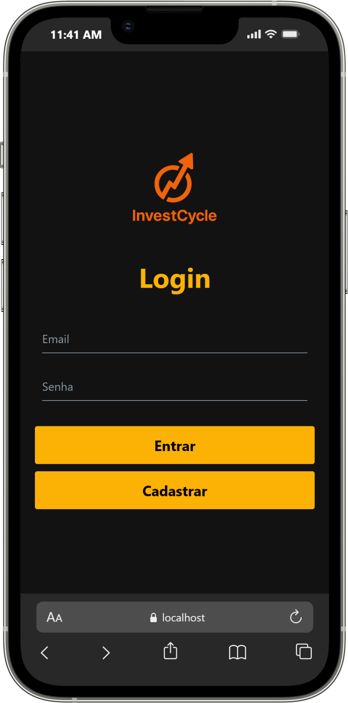
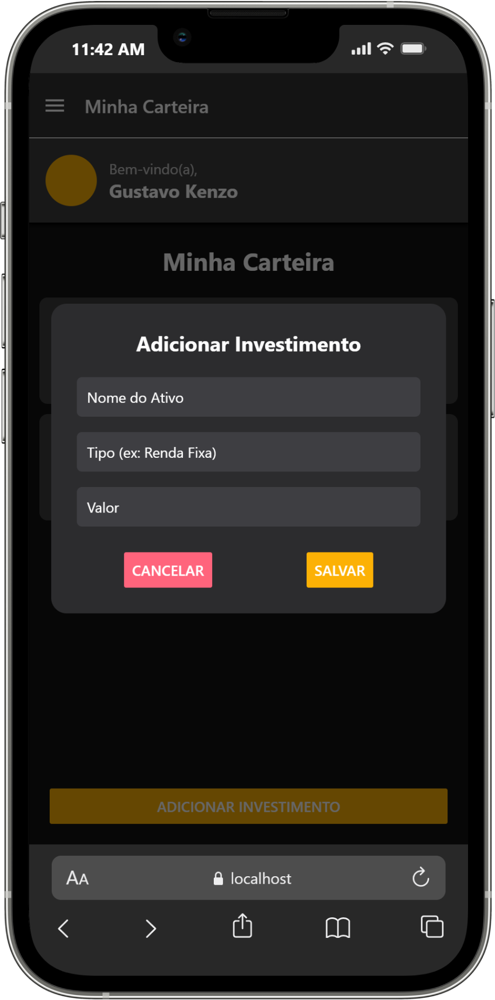
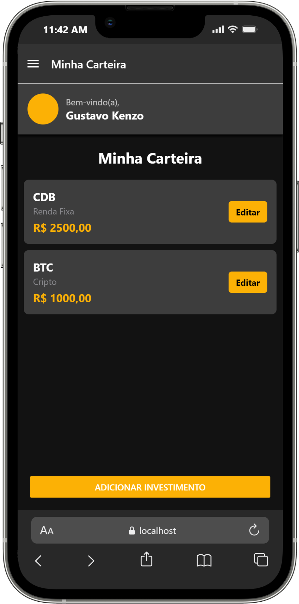
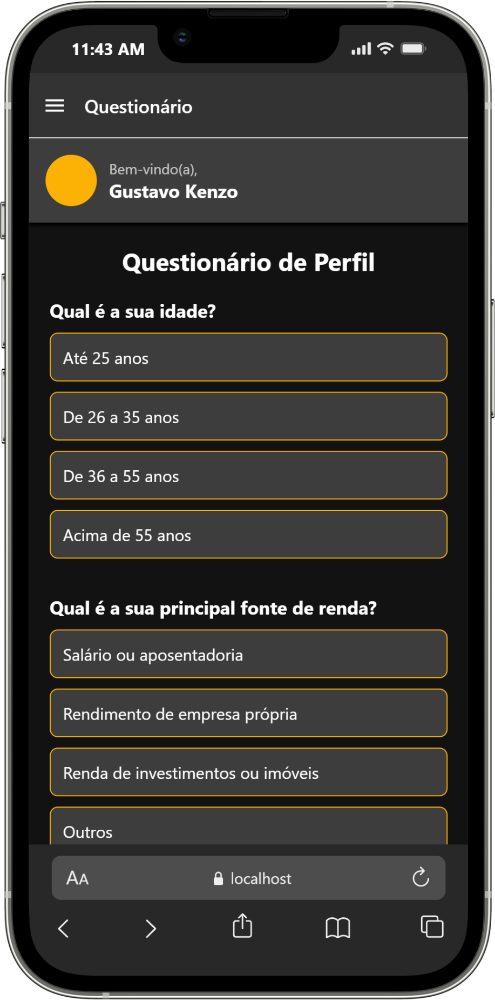
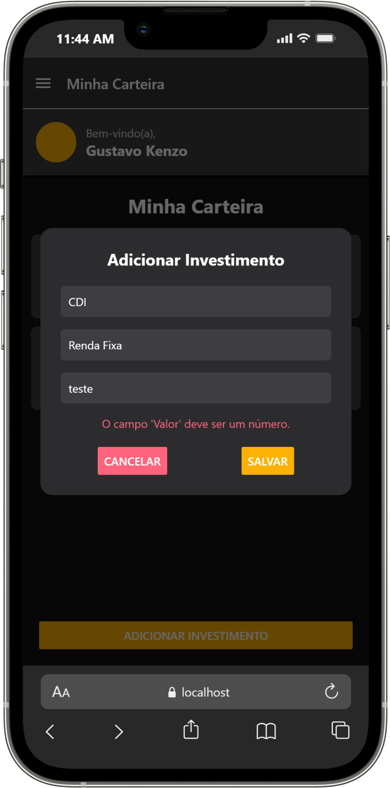
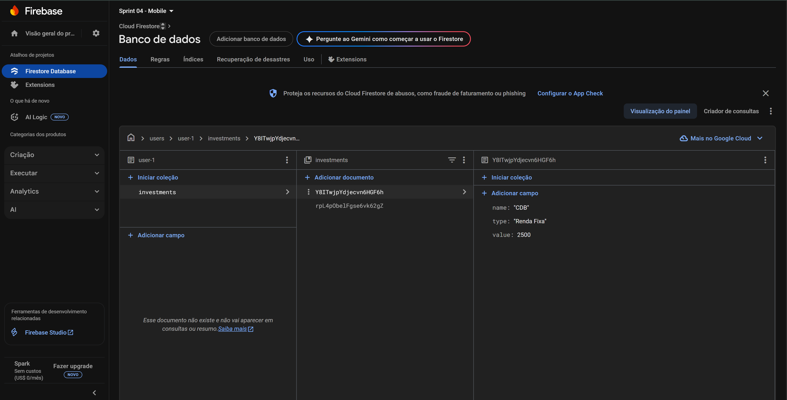

# Challenge MOBILE DEVELOPMENT AND IOT
## 3ESA
- Gustavo Kenzo - 98481
- Vinícius Almeida Bernardino de Souza - 97888
- Márcio Hitoshi Tahyra - 552511

## Como Testar o Login

O aplicativo possui um sistema de registro:

1.  Na tela de login, clique em "Cadastrar".
2.  Crie um novo usuário com os dados que desejar.
3.  Após o cadastro, você será logado e direcionado para a tela principal.
4.  Para testar o login, saia do aplicativo (pelo menu) e entre novamente usando as credenciais que acabou de criar.
5.  Para testar a persistência, feche e reabra o aplicativo. Você deverá ser levado diretamente para a tela principal.

## Funcionalidades do Aplicativo

O aplicativo conta com um fluxo completo, desde a autenticação do usuário até a personalização de sua experiência de investimento.

### Autenticação e Sessão

- Cadastro de Usuários: Permite que um novo usuário crie uma conta fornecendo nome, e-mail e senha. As informações são salvas de forma segura no armazenamento local do dispositivo.
- Login de Usuários: Autentica usuários com base nas credenciais previamente cadastradas.
- Persistência de Sessão: Utilizando o `AsyncStorage`, o aplicativo "lembra" do usuário que já fez login. Ao fechar e reabrir o app, o usuário é levado diretamente para a tela principal, sem a necessidade de inserir suas credenciais novamente.
- Logout: O usuário pode encerrar sua sessão de forma segura através de um botão no menu de navegação, que limpa os dados do `AsyncStorage`.

### Navegação

- Navegação Principal (Drawer Navigation): Após o login, a navegação principal é controlada por um menu lateral (Drawer).
- Menu Customizado: O menu foi customizado para exibir as opções de navegação de forma clara, além de informações do usuário e o botão de Sair.
- Rotas Protegidas: Todas as telas de conteúdo principal só são acessíveis após a autenticação bem-sucedida do usuário.

### Perfil de Investidor (Suitability)

- Questionário Interativo: O usuário pode responder a um questionário completo com perguntas de múltipla escolha para definir seu perfil de investidor. As respostas são salvas no `AsyncStorage` para futuras consultas.
- Cálculo e Exibição do Perfil: Com base nas respostas do questionário, o aplicativo calcula automaticamente o perfil do investidor (Conservador, Moderado ou Arrojado) e o exibe de forma clara para o usuário na tela de "Perfil de Investimentos".

### Carteira e Sugestões

- Sugestões Personalizadas: A tela de "Sugestões" exibe diferentes carteiras de investimento de acordo com o perfil calculado do usuário, oferecendo opções personalizadas e relevantes.
- Seleção de Carteira: O usuário pode escolher uma das carteiras sugeridas, e sua seleção é salva no `AsyncStorage`.
- Visualização da Carteira: A tela "Minha Carteira" exibe os detalhes da carteira que foi selecionada pelo usuário, concluindo o fluxo de personalização.

## Telas

### Tela de login

### Adicionar investimento

### Visão geral da carteira

### Questionário

### Erro 1 - Tentar inserir investimento sem completar o campo

### Erro 2 - Tentar inserir investimento com letra no campo de valor

## banco de Dados - Firebase

